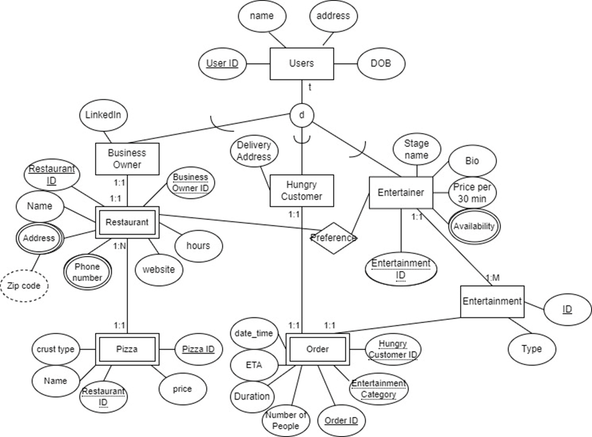

Pizza Deliver and Entertainment
================
Mishan Phiri
2023-12-07

# Brief:

One of your acquaintances thinks he has the next billion-Rand startup idea for an app: Pizza Delivery with Entertainment. He explains the basic functionality of the app as follows:
Customers can order pizzas from restaurants to be delivered to a specific address, and customers can choose a special “entertainment order” option. When an order is an entertainment order, the delivery person stays with the customer after delivering the pizza and entertains the customers (e.g., by singing, making jokes, doing magic tricks, etc.) for a certain amount of time. Now follows a detailed explanation of the range of capabilities of the app. When people create an account on the app and become app users, they have to provide their date of birth, name, and address. Every user should also be uniquely identifiable. Once the account is created, the users will be presented with three options: business owner, hungry customer, and entertainer.
The first option is to sign up as a “business owner”. Business owners will also be asked to provide their LinkedIn account so they can be added to your friend’s professional network. Every business owner can own several pizza restaurants. Of these pizza restaurants, your friend wants to register the zip code, address, phone number, website, and hours of operation .
Each pizza restaurant can offer a number of pizzas. Of those pizzas, your friend wants to keep the name (e.g., margarita, siciliana, strega etc.), the crust type (e.g., classic Italian crust, deep dish crust, cheese crust), and the price. While two pizzas from different pizza restaurants may have the same name, they will not be exactly the same, as the taste will be different, and therefore they should be considered unique. Pizzas should be distinguishable even if they have the same price, e.g., a margarita pizza from Debonairs Pizza in Cape Town which costs R89.99 must be distinguishable from a margarita pizza from Col’Cacchio, which also costs R89.99.
The second option in the app is to select “hungry customer”. Hungry customers will need to provide a delivery address. Hungry customers can make orders for pizzas. Each order gets assigned an ID, and your friend wants the app to log the date and time of when the order was placed. The app also allows the hungry customer to indicate the latest time of delivery, and ask for how many people the order is. An order can be for one or more pizzas.
Hungry customers can request a special type of order: the entertainment order. Not every order has to be an entertainment order. But when a hungry customer indicates that he or she wants to be entertained while eating the pizza, we not only want to register all the regular order information, but also the type of entertainment the user requests, and for how long (a duration).
The third option in the app to select is that of “entertainer”. When users select entertainer, they must provide a stage name, write a short bio about themselves, and indicate their price per 30 minutes. Every entertainment order is fulfilled by exactly one entertainer. Every entertainer can choose for which pizza restaurant(s) he or she wants to work. For each pizza restaurant, an entertainer wants to work with, he or she should indicate his or her availability by day (Monday, Tuesday, Wednesday, etc.)

# Database Management model 
## EER conceptual data model for the data requirements
*Entity Types:* Users, Business User, Hungry Customer, Entertainer, Restaurant, Pizzas, Order, Entertainment.
*Reasoning:* Each entity has an occurrence and represents a concept with an unambiguous meaning. 
Attribute Types:
<table>

| Entity Type | Attribute Type                                                         |
|------------------|-------------------------------------------------------------------|
| `Users`          | **User ID**, name, address, DOB                                   |
| `Business Owners`| LinkedIn                                                          |
| `Customer`       | Delivery address |
|`Entertainer` | _Entertainment ID_ , stage name, bio|
| `Restaurants`    | **Restaurant ID**, name, zip code, address, phone number, website hours, _usiness owner ID__ |
| `Pizzas`         | **Pizza ID**, _Resaurant ID_, name, crust type, price                |                                                     
| `Order`| **Order ID** _Customer ID_, date_time, ETA, number of people, _entertainment category_, duration|
|`Entertainment` | **ID**, type|
<table>[Bold represents keys, and Italics represent foreign keys]

### Notes
1. Three weak entities exist whithin this datadase namely:
* `Order` cannot exist without a customer creating one.
* `Restaurant` cannot exist without a customer creating one.
* `Pizza` is dependent on the existence of a restaurant.
2. `Users` is a superclass that has three specialisations, `customer`, `business owner` and `entertainer`, and it is a total disjoint specialization.

### EER Diagram
Below we have the EER diagram to visually represent all relationships whithin the database.

